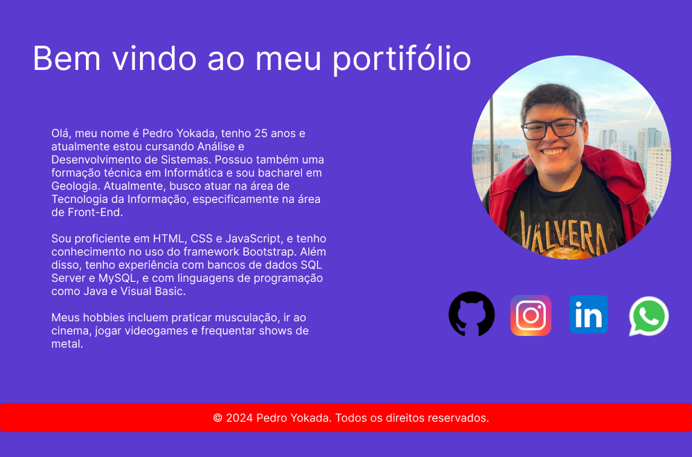
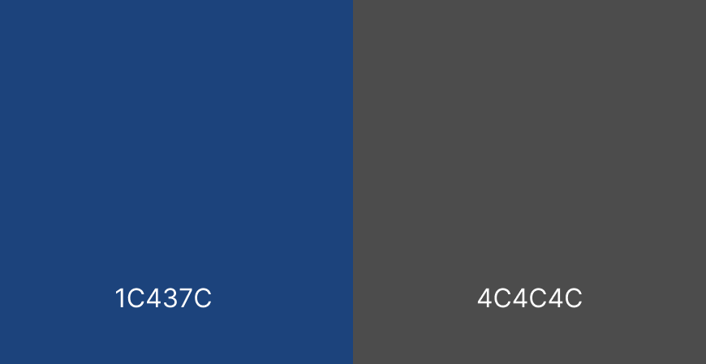

# 📝 Módulo IV — WordPress | Bootcamp Kick

## 📌 Sobre o módulo

Esta pasta registra as atividades do **Módulo IV do Bootcamp Kick**, cuja proposta foi construir um site em WordPress com temática de **portfólio pessoal**. O desenvolvimento aconteceu em etapas: primeiro foi criado um rascunho visual no Figma, depois foram definidas cores e fontes e, em seguida, foram registradas versões do portfólio e uma atividade colaborativa em grupo.

Os arquivos preservados nesta pasta são principalmente **capturas de tela e materiais visuais**. Não há, nesta consolidação, o código-fonte completo de uma instalação WordPress; por isso, a documentação abaixo descreve apenas o que os materiais existentes sustentam.

## 🎯 Objetivo

Conhecer o processo de construção de um site através de um **CMS**, relacionando planejamento visual, identidade gráfica, edição de páginas e organização de conteúdo.

## 🧠 Conceitos técnicos

### O que é um CMS?

**CMS (Content Management System)** significa Sistema de Gerenciamento de Conteúdo. É uma plataforma que permite estruturar e administrar conteúdo de um site através de uma interface de gerenciamento, reduzindo a necessidade de escrever manualmente toda a estrutura da aplicação para cada alteração de conteúdo.

Neste módulo, o CMS utilizado foi o **WordPress**.

### WordPress

WordPress organiza o processo de criação do site em uma plataforma de gerenciamento. Em um projeto desse tipo, o conteúdo e a aparência podem ser configurados através do ambiente administrativo e das opções disponíveis na instalação utilizada.

Os materiais deste repositório mostram a construção progressiva de um portfólio pessoal, mas não registram quais temas, plugins ou configurações internas específicas foram utilizados. Esses detalhes, portanto, não são afirmados nesta documentação.

### Figma antes do WordPress

No **Desafio 35–36**, foi criado um esboço/rascunho da página no Figma antes de construir a versão no WordPress.



Planejar a página antes da implementação ajuda a definir:

- hierarquia das informações;
- distribuição das seções;
- ordem do conteúdo;
- identidade visual pretendida.

### Paleta de cores

No **Desafio 37–38**, a atividade solicita a definição da paleta de cores e sua aplicação ao site.



Uma paleta reúne cores escolhidas para serem utilizadas de forma consistente. A repetição controlada das mesmas cores contribui para identidade visual e evita que cada parte da página pareça pertencer a um projeto diferente.

### Tipografia

A mesma etapa também documenta a escolha das fontes.


Tipografia envolve mais do que escolher uma fonte: ela influencia legibilidade, hierarquia e personalidade visual. Títulos, textos e elementos de destaque podem utilizar pesos ou tamanhos diferentes para criar níveis de importância.

### Evolução visual do portfólio

A pasta `Desafio3738/` contém quatro capturas da construção do site. Elas funcionam como documentação visual do estado do projeto naquele momento.

### Trabalho colaborativo

No **Desafio 39–40**, o projeto foi realizado em grupo. O enunciado preservado distribui atividades entre alunos: uma pessoa cria a página e compartilha a tela, enquanto outras pesquisam seções e ajudam na criação do conteúdo.


Essa dinâmica pratica um conceito importante de projetos digitais: **divisão de responsabilidades e colaboração**. Mesmo quando todos trabalham no mesmo produto, cada participante pode assumir uma tarefa específica e depois integrar o resultado ao trabalho coletivo.

## 📈 Evolução do módulo

```text
Planejamento no Figma
        ↓
Rascunho do portfólio
        ↓
Definição de cores
        ↓
Definição de tipografia
        ↓
Construção no WordPress
        ↓
Registro da evolução
        ↓
Atividade colaborativa
```

## 🛠️ Tecnologias e ferramentas registradas

- WordPress
- Figma
- fundamentos de UI/UX
- paleta de cores
- tipografia
- organização de conteúdo

## 📂 Estrutura

```text
modulo-iv-wordpress/
├── Desafio3536/
├── Desafio3738/
├── Desafio3940/
└── README.md
```

## 🌐 Portfólio registrado no material original

O README original preservava um endereço do portfólio WordPress utilizado na entrega do Bootcamp:

`https://pedro-yokada.soukick.com.br/`

A disponibilidade atual desse endereço depende do serviço externo e não é necessária para consultar os materiais preservados neste repositório.

## 💡 Aprendizados

O módulo demonstra que a criação de um site não depende apenas de código. **planejamento visual, organização do conteúdo, consistência gráfica e colaboração** também fazem parte do processo de desenvolvimento de uma experiência digital.

## 🔗 Navegação

- [Voltar ao repositório principal](../../README.md)
